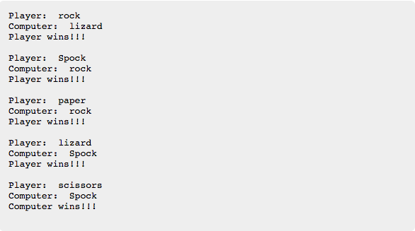
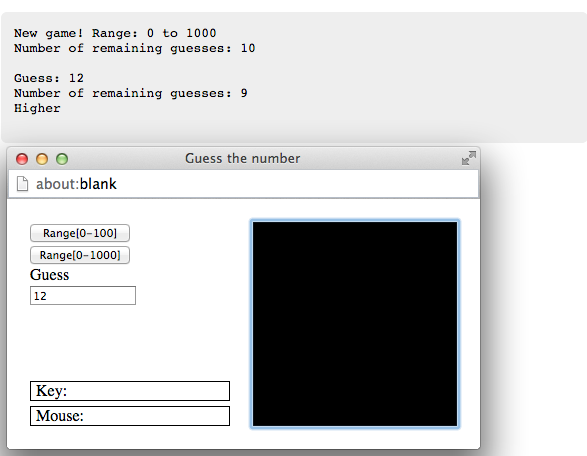

An_Introduction_to_Interactive_Programming_in_Python_Coursera
=============================================================

I took this course in 2013 on Coursera and it was my first experience with Python. I learned a lot and since then I have used the Python programming language many more times.  

This course had a duration of 9 weeks. Each week, there was a Quizz to evaluate what was taught and in most of the weeks also an assignment.  
The course had a total of 7 projects. In the next lines I will briefly explain each project and present a link to [codeskulptor](http://www.codeskulptor.org/), a browser-based Python interpreter. It implements a subset of Python 2, plus the addition of three graphical libraries, *SimpleGui*, *SimpleMap*, and *SimplePlot*. More info can be found [here](http://www.codeskulptor.org/docs.html#tabs-Python).  
  
Clicking the link of each project will open codeskulptor in your browser with the code that I developed. To run it simply press the **run button**.  
**If you want to make any changes or experience with the code, please press the button that generates a fresh url, since otherwise you could end up changing my code.**

## Project 1: Rock-paper-scissors-lizard-Spock
As the name of the project indicates, the idea was to build a simple game of *Rock-Paper-Scissors*, with two additional options, *Lizard* and *Spock*. The introduction of these two new elements was inspired in the Big Bang Theory TV-Show. If you are familiar with it, you know the rules, otherwise play a little to discover.  
In this first assignment the game does not ask you for input. Instead you should write your choices on the *# test you code* section on codeskulptor editor. Then after pressing play, the computer will randomly choose between the options and compare them to your choices, and print your choice, its choice and who won, or if it was a tie.  

[PLAY](http://www.codeskulptor.org/#user38_YTyaWb6TIw8d6qP.py)

## Project 2: Guess the number
The objective of this game is for the player to guess a number chosen by the computer, between a certain range, and having only a limited number of attempts.  
The player can choose between guessing a number in the [0-100] range, and has 7 attempts, or between the [0-1000] range, with 9 attempts.  

[PLAY](http://www.codeskulptor.org/#user38_ZKF3cuQn9VVo618.py)

## Project 3: Stopwatch
In this project a simple Stopwatch was built.

[START](http://www.codeskulptor.org/#user38_fv8qAuD4VCIt9NH.py)

## Project 4: Pong
This game needs no introductions! It's the famous game of PONG!  
Use *W* and *S* to control the left paddle, and *UP* and *DOWN* arrows to control the right one.  

[PLAY](http://www.codeskulptor.org/#user38_gYssnLxFM8BPDat.py)

## Project 5: Memory
This is a game for testing your memory! The objective is simple: Match all the 16 cards with their correct pairs, in the smallest number of attempts.  
There are 8 numbers (0 to 7) with each number appearing twice. Their distribution is totally random. Cards are faced down and each time the player clicks on a card, it turns up, revealing the correspondent number. When the player clicks on another card, if the number is the same, then there is a match and the cards stay up, else both cards turn down. The game ends when the player can match all the cards. The lowest the number of attempts needed, the better!  

[PLAY](http://www.codeskulptor.org/#user38_mGofRebWXGY1j3A.py)

## Project 6: Blackjack
This game is a slightly simplified version of the popular Blakcjack cards game.  
Remember, the house always win!

[PLAY](http://www.codeskulptor.org/#user8-NFL7oPrFVYZQc8Z.py)

## Project 7: Asteroids
Which better game to finish with, than the well known Asteroids!?  
In this game the player controls a spaceship (*directional arrow keys*), and the objective is to evade and destroy the maximum number of asteroids, before running out of lives (only 3 available)! Thankfully the ship is equipped with the latest top of the art missile system (*space* key to use it)! But be careful, these are some mean bastard asteroids, and their velocity keeps increasing!  
Enjoy the visual and audio special effects and may the force be with you!  

[PLAY](http://www.codeskulptor.org/#user38_Jsh311awepIiqvC.py)
